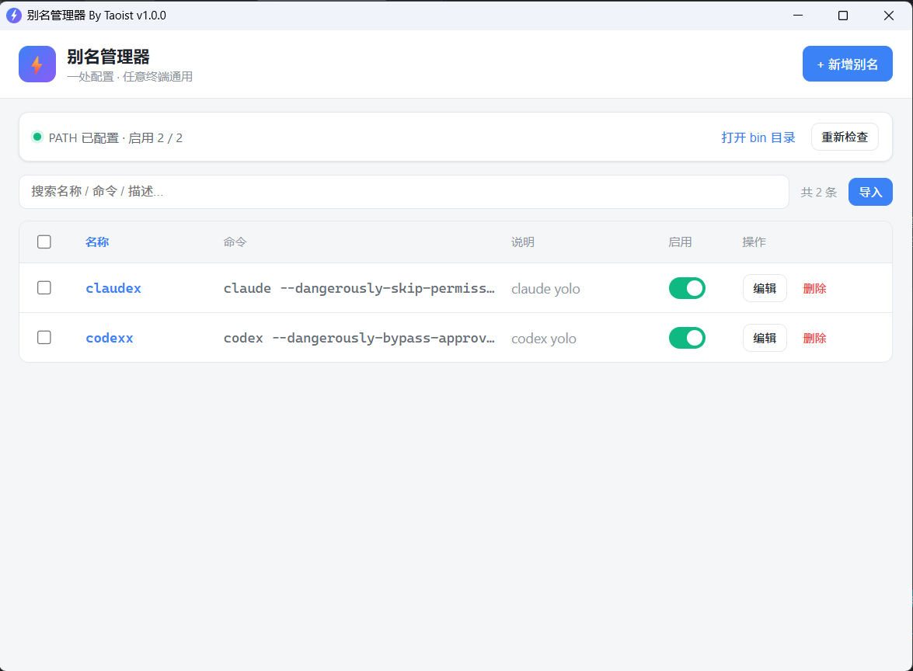
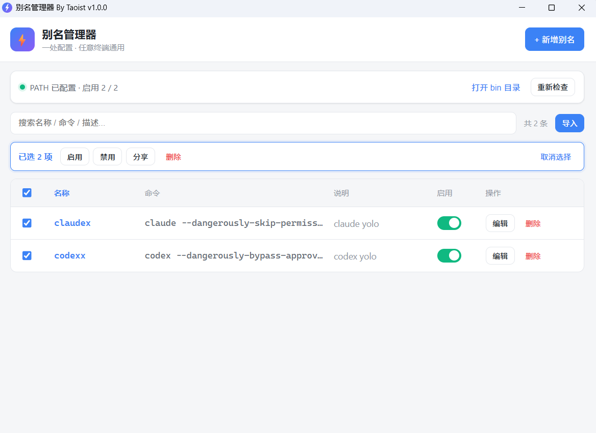

# 别名管理器（AliasManager）

> 通过 GUI 集中管理命令别名，一处配置，PowerShell / CMD / Git Bash 等**任意终端**通用。基于 **Tauri 2 + Rust + Vue 3**。

## 简介

日常开发中我们常用一些带冗长参数的命令，例如 `claude --dangerously-skip-permissions`。本工具让你在可视化界面里把它们定义成短别名（如 `claudex`），保存后即可在任意终端直接输入 `claudex` 使用，额外参数自动透传。

核心采用 **PATH Shim** 方案：为每个别名在统一 bin 目录下生成一个 `.cmd` 转发文件，再把该目录加入用户 `PATH`。因为 PATH 是所有终端共同识别的机制，所以一处配置、处处生效，无需为每种 shell 单独适配。

## 界面预览

| 主界面 | 批量操作 / 分享导入 |
|:---:|:---:|
|  |  |

## 功能特性

- **可视化 CRUD**：新增 / 编辑 / 删除 / 启用-禁用别名，带实时搜索
- **任意终端通用**：PowerShell、CMD、Git Bash 等均识别，无需逐 shell 配置
- **一键配置 PATH**：自动把 bin 目录加入用户 PATH（写注册表 + 广播），无需管理员
- **启动自愈**：每次启动按数据同步 shim 文件，并清理孤儿文件
- **参数透传**：`claudex --version` → `claude --dangerously-skip-permissions --version`
- **现代界面**：Vue 3 实现，深浅色自适应

## 工作原理

保存别名 `claudex = "claude --dangerously-skip-permissions"` 后，在 bin 目录生成：

```cmd
@echo off
call claude --dangerously-skip-permissions %*
```

随后把 bin 目录写入用户级 `HKCU\Environment\Path`，并广播 `WM_SETTINGCHANGE` 让新进程感知。重新打开任意终端，输入 `claudex` 即触发上述 `.cmd`，经 `call` 转发到真实命令并透传额外参数。

## 技术栈

| 层 | 技术 |
|---|---|
| 桌面框架 | Tauri 2 |
| 后端 | Rust + serde / chrono / uuid / winreg + windows-sys |
| 前端 | Vue 3 + Vite + `@tauri-apps/api` |
| 存储 | JSON 文件（`aliases.json`） |
| 生效机制 | PATH Shim（生成 `.cmd` + 写用户 PATH） |

## 快速开始

### 环境要求

- Rust（stable，本项目在 1.90 上开发）
- Node.js + pnpm
- Windows 构建还需 MSVC 工具链（Visual Studio Build Tools）

### 开发运行

```bash
pnpm install          # 安装前端与 @tauri-apps/cli
pnpm tauri dev        # 编译 debug + 启动窗口（前端热重载）
```

首次使用流程：

1. 点右上角「+ 新增别名」，填写名称（如 `claudex`）、命令（如 `claude --dangerously-skip-permissions`）
2. 保存后，若状态栏提示「未配置 PATH」，点「一键配置 PATH」
3. **重新打开**终端（PATH 变更对已开终端不生效），输入 `claudex` 即可

## 项目结构

```
alias_manager/
├── package.json                 # vue/vite/@tauri-apps 依赖与脚本
├── vite.config.js
├── index.html                   # Vite 入口
├── pnpm-workspace.yaml          # pnpm 设置（批准 esbuild 构建）
├── app-icon.png / generate-icon.ps1   # 图标源素材
├── src/                         # Vue 前端
│   ├── main.js
│   ├── App.vue
│   ├── api.js                   # invoke 封装
│   ├── styles.css
│   └── components/
│       ├── AliasList.vue        # 列表 + 搜索 + 开关 + 操作
│       ├── AliasForm.vue        # 新增/编辑模态
│       └── StatusBar.vue        # PATH 状态 + bin 目录
└── src-tauri/
    ├── Cargo.toml
    ├── tauri.conf.json
    ├── build.rs
    ├── capabilities/default.json
    ├── icons/                   # tauri icon 生成的全套图标
    └── src/
        ├── main.rs              # 入口
        ├── lib.rs               # Builder + setup（建目录/同步 shim/注册命令）
        ├── store.rs             # aliases.json 读写
        ├── alias.rs             # Alias 结构、校验、shim 生成/删除
        ├── path_env.rs          # Windows 用户 PATH 注册表读写 + 广播
        └── commands.rs          # 9 个 #[tauri::command]
```

## 数据存储

- 别名数据：`%LOCALAPPDATA%\com.taoint.aliasmanager\aliases.json`
- bin 目录（shim）：`%LOCALAPPDATA%\com.taoint.aliasmanager\bin\`
- PATH：写入用户级 `HKCU\Environment\Path`（类型保持 `REG_EXPAND_SZ`，不展开原有变量）

## 后端命令

| 命令 | 说明 |
|---|---|
| `list_aliases` | 返回全部别名 |
| `add_alias` / `update_alias` | 校验 + 写 JSON + 生成/更新 shim |
| `delete_alias` | 删 JSON + 删 shim |
| `toggle_alias` | 启用建 / 禁用删 shim |
| `get_status` | bin 路径、PATH 是否已配置、统计 |
| `ensure_path` | 将 bin 加入用户 PATH + 广播 |
| `open_bin_dir` | 资源管理器打开 bin 目录 |
| `test_alias` | 检查 shim 存在 + bin 在 PATH |

## 打包发布

```bash
pnpm tauri build      # 生成安装包（msi / nsis），产物在 src-tauri/target/release/bundle/
```

## 重新生成图标

```bash
powershell -ExecutionPolicy Bypass -File generate-icon.ps1   # 生成 app-icon.png
pnpm tauri icon app-icon.png                                 # 生成 src-tauri/icons/ 全套
```

## 已知限制

- WSL 内部默认不继承 Windows bin 目录，WSL 终端需另行配置
- PATH 变更对**已打开**的终端不生效，需重开（软件内会提示）
- Shim 用 `.cmd` 转发，命令含复杂管道/重定向时按 cmd 语义解释

## License

MIT
